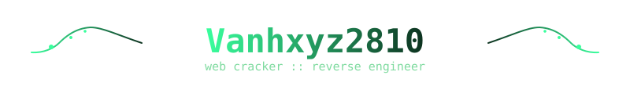
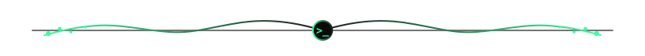
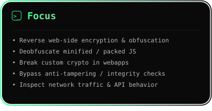
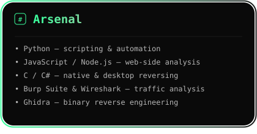
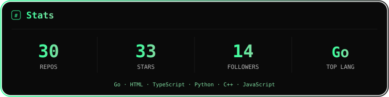

<div align="center">



</div>

<p align="center">
  
</p>

<div align="center">

```
[+] Status  : Reading minified/obfuscated JS so you don't have to
[+] Contact : vanhlegend2k6@gmail.com
```

<p>
  
  
</p>

</div>

<p align="center">
  
</p>

<div align="center" style="display:flex; justify-content:center; gap:16px; flex-wrap:wrap;">
  
  
</div>

<p align="center">
  
</p>

<div align="center">

<h3>connect</h3>

<a href="https://www.facebook.com/vanhxyzdev" target="_blank">
  
</a>
<a href="mailto:vanhlegend2k6@gmail.com" target="_blank">
  
</a>

</div>

<p align="center">
  
</p>

<div align="center">
  
</div>

<p align="center">
  
</p>

<div align="center">

```
> exit
```

</div>
